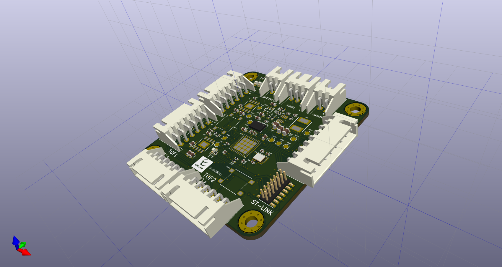

# 🐱 **StealthKitty - Projet Robot Chat**  

    
[](https://www.ensea.fr)
  


---

## 📜 **Description**  
StealthKitty est un projet de **système embarqué innovant** basé sur un **STM32**.  
🎯 **Objectif :** Développer plusieurs robots capables de se déplacer sur une table sans bordure.  

- 🐾 Un robot est désigné comme chat et doit attraper un autre robot, qui devient alors le nouveau chat.  

Ce projet est réalisé dans le cadre de la dernière année de la filière **électronique et systèmes embarqués (ESE)** de l'ENSEA.

### **Les contributeurs :**  
- 👨‍💻 **Vincent LAKHMECHE**  
- 👨‍💻 **Mohamed Rafik CHAIR**  
- 👨‍💻 **Meziane Ameur**  
- 👨‍💻 **Karim JERJOUB**  




---

## 📚 **Table des matières**  A REECRIRE
1. [📖 Contexte](#-contexte)  
2. [✨ Fonctionnalités](#-fonctionnalités)  
3. [🔧 Matériel utilisé](#-matériel-utilisé)  
4. [📐 Architecture](#-architecture)  
5. [🚀 Utilisation](#-utilisation)  
6. [👥 Auteurs](#-auteurs)  
7. [📄 Licence](#-licence)  

---

## 📖 **Contexte**  
Ce projet s'inscrit dans le cadre de la formation 3A à l'ENSEA.  
🎯 L'objectif est de concevoir un système embarqué complet, depuis la conception électronique jusqu'à l'implémentation logicielle.

---

## ✨ **Fonctionnalités**  
- 🛡️ **Détection de bords** via des capteurs ToF.  
- 🔄 **Communication entre robots** pour synchronisation.  
- 🎯 **Algorithme de poursuite et d'évitement.**  
- ⚙️ **Gestion des moteurs**  

---

## 🔧 **Matériel utilisé**  
- **STM32G431RB** : Microcontrôleur principal.  
- **Capteurs ToF** : Détection des bordures.  
- **LiDAR** : Cartographie et détection d'autres robots.  
- **Accéléromètre (ADXL343)** : Détection des chocs pour changer de rôle (Chat/Souris).  
- **Environnement de développement :** STM32CubeIDE.  

---

## 📐 **Architecture**  
### **Schéma architectural**  


Ce schéma ne détaille pas que chaque moteur a sa propre pwm et son driver propre également.

## Explication du fonctionnement du système

1. **⚡ Alimentation principale**
   - La **batterie NiMH 7.2V 1.3Ah** alimente l'ensemble du système. Elle est connectée à des régulateurs de tension pour fournir les différentes tensions nécessaires aux composants :
     - **MP1475S** : Régulateur 5V pour alimenter les moteurs et certains capteurs.
     - **BU33SD5WG-TR** : Régulateur 3.3V pour alimenter le microcontrôleur STM32G431, l'accéléromètre et le LiDAR.

2. **🖥️ Microcontrôleur principal - STM32G431**
   - Le **STM32G431** gère toute la logique du robot et communique avec les différents composants via des bus tels que SPI, UART, I2C et PWM.
   - Il est relié à un **quartz 16 MHz** pour la gestion de l'horloge système et dispose d'un connecteur **SWD** pour la programmation et le débogage.

3. **🔍 Capteurs**
   - **Capteurs ToF** : Utilisés pour détecter les bords ou les chutes du robot.
   - **ADXL343 (Accéléromètre)** : Détecte les impacts ou les tapotements, utilisé pour détecter les collisions avec d'autres robots, et connecté au bus **SPI**.
   - **LiDAR YDLIDAR X4** : Permet de détecter les obstacles à l'aide de la communication **UART** pour transmettre les données de distance et d'angle.

4. **⚙️ Contrôle des moteurs**
   - **ZXBM5210-SP-13 (Driver de moteur)** : Utilisé pour contrôler la direction et la vitesse des moteurs à l'aide de signaux **PWM**. Le microcontrôleur STM32 contrôle les moteurs via le driver pour ajuster la vitesse et la direction du robot.

5. **🌟 Indicateurs d'état (LEDs)**
   - Les **LEDs** servent d'indicateurs pour visualiser l'état du robot, par exemple, lorsqu'il est en marche ou lorsqu'il détecte un obstacle.

### Détails des principaux outils utilisés

1. **Communication avec l'accéléromètre (ADXL343)**
   - Utilisation du protocole **SPI** pour lire les données des axes X, Y et Z.
   - Détection des chocs (taps) causés par des collisions avec d'autres robots.

2. **Contrôle des moteurs avec le driver ZXBM5210**
   - Génération de signaux **PWM** pour réguler la vitesse des moteurs.
   - Implémentation des mouvements du robot : avancer, reculer, tourner à gauche ou à droite.

3. **Gestion des capteurs de bordure/détection de chute**
   - Lecture des entrées des capteurs pour détecter les bords de la table.
   - Réaction immédiate pour stopper ou changer de direction afin d’éviter une chute.

4. **Interfaçage avec le LiDAR YDLIDAR X4**
   - Communication via **UART** pour lire les données du LiDAR.
   - Extraction des valeurs d’angles et de distances pour cartographier l'environnement et éviter les obstacles.

---

## 🚀 **Réalisation matérielle**  
La partie matérielle a été conçue avec **KiCad 8.0** et comprend :  
- 📜 **Schéma électronique**  
- 🧩 **PCB routé**  
- 🛠️ **BOM (Bill of Materials)**  
- 🗂️ **Fichiers GERBER** pour fabrication chez **JLCPCB**.  

Pour construire notre carte électronique, il nous a fallut commencer par designer sous KiCad le schéma électrique de notre système électronique, ce que l'on appelle schematic dans KiCad. Nous allons maintenant détaillé les différentes parties du schematic (les sheets du projet KiCad).

## Schéma électronique ## 
#### Capteurs du robot #####

Le robot contient plusieurs capteurs, un capteur Time Of Flight TOF, un capteur LIDAR, et un capteur accéléromètre.

Le capteur TOF est un capteur de distance qui communique en I2C avec le cerveau du robot qu'est la stm32. L'avantage de cette communication est qu'elle permet une évolutivité si on a besoin d'ajouter d'autres composants matériel par la suite. Seulement pour cela il faut prévoir une résistance de pull-up (tirage) pour le bus I2C.


Les signaux nécessaires pour implémenter en I2C ce capteur sont les suivants : 

- SDA
- SCL
- int_tof1
- xshunt1
- GND

Ces signaux sont représentés sur le connecteur JST de la figure ci-dessous.

 


Le capteur Accéléromètre  est un capteur qui communique lui en SPI, tout comme le capteur TOF , il utilise un bus de communication qui nécessite une résistance de pull-up (tirage).

 

Les signaux nécessaires pour implémenter en SPI ce capteur sont les suivants : 

- MISO

- MOSI

- SCK

- nCS

- Interruption n°1 ADX

- Interruption n°2 ADX

- +5V

- GND

  

  

Comme on peut le voir, pour des raisons CEM nous avons placé une capacité de 1µF et une capacité de 0.1 µF pour découpler les deux alimentations en +3.3V.

Afin de pouvoir débugger le capteur, nous avons également placé des points de test TestPoint.


Le capteur LIDAR est un capteur qui communique par liason série UART dont les signaux sont les suivants :


- M_EN
- DEV_EN
- M_SCTR
- RX_lidar
- TX_lidar
- +5V
- GND


#### Motorisation du robot ####

Les composants qui s'assure déplacer le robot sont les moteurs qui sont des mcc **FIT 0520.** 

Pour commander ces moteurs nous avons besoin de driver, ce sont eux qui vont envoyer les signaux de commande au moteur (des PWM). 

Les drivers utilisés sont les ZXBM5210-S-13. 


Voici le schéma du composant. Les sorties out 1 et out 2  sont connectés au moteur  par Motor1+ et  Motor 1-.

Comme ce sont les signaux de commande PWM, nous avons découplé ces signaux avec des capacités de 100nF.

Quant aux signaux d'alimentation nous découplons la tension de la batterie avec une capacité de 10µF pour le signal Vm et une capacité de 1µF pour 


Le signal PWM_MOT1_CH1 est le signal PWM généré par le STM32 en direction du pin FWD du composant .
Le signal PWM_MOT1_CH2 est le signal PWM généré par le STM32  en direction du pin REV du composant.


D'après le tableau de la datasheet, si on envoie un signal PWM pour contrôler le driver en mode "PWM control mode". 

Il faut alors envoyer un signal PWM en entré sur un des pins FWD ou REV. Ce qui donnera naissance à un signal PWM en sortie sur out1-out2 de fréquence égale à celle en entrée du pin qui reçoit le signal PWM.   
Comme nous avons deux moteurs, il faut deux drivers, voici le schéma du deuxième driver : 


Pour obtenir la vitesse des roues, nous utilisons les encodeurs des moteurs. Pour cela il faut préparer, l'alimentation et les signaux dont ils ont besoin dans un connecteur (jst en l'occurrence).
  


D'après la documentation des moteur/encodeurs, les signaux sont placés de la façon suivante sur le brochage : 


On peut lire sur cette image que les signaux de l'encodeur sont les suivants : 
 - alimentation 3V3
 - ground GND
 - codeurX_PH1 [pour la phase A]
 - codeurX_PH2 [pour la phase B]


Nous avons placé ces signaux entre les deux signaux destinés au moteurs et conservé l'ordre d'affectation des broches de la doumention, ce qui donne ce schéma de connector : 


#### Le Cerveau du robot : le STM32 & cie #### 

Dans cette feuille, nous avons connecter les composants suivants, le STM32, le STlink, le Quartz, des leds, un bouton pour changer d'état et un bouton NRST pour reset le STM32.
  

#####  le STM32  #####

résistance de tirage bus I2C

découplage alim stm32 à dire 
#####  le quartz #####
découplage OSC_In OSC_OUT du quartz 

#####  le STLink #####

#####  les boutons #####


### 🔑 [Accédez aux fichiers hardware ici.](./hardware/)

---

## 🛠️ **Développement logiciel**  
Le logiciel embarqué a été développé avec **STM32CubeIDE** et inclut :  
- 🔧 **Configuration des périphériques** (SPI, UART, PWM, etc.).  
- 📦 **Modules logiciels** pour capteurs et moteurs.  
- 🤖 **Algorithmes embarqués** pour les comportements du robot (poursuite, évitement, etc.).  

### 📂 [Accédez au code source ici.](./Software)

---

## 👥 **Auteurs**  
- **Vincent LAKHMECHE**  
- **Mohamed Rafik CHAIR**  
- **Meziane Ameur**  
- **Karim JERJOUB**

---

## 📄 **Licence**  
📝 Ce projet est sous licence **MIT**.  
Pour plus d’informations, consultez le fichier [LICENSE](./LICENSE).  


# 🚀 Explication sur l'utilisation de l'accéléromètre ADXL343 dans le robot chat


---

## 🎯 Objectifs principaux
- ✨ **Détecter les tapotements** (Single Tap/Double Tap) pour **changer de rôle** entre le robot "chat" et le robot "souris".
- 📊 Lire les valeurs d'accélération sur les axes **X, Y, Z** *(optionnel)*.

---

## ⚙️ Configuration
- **Plage d'accélération :** ±2 g *(précision pour petits mouvements)*.
- **Registres utilisés :**  
  - 🛠️ `POWER_CTL` : Activer le mode mesure.  
  - 🎚️ `THRESH_TAP`, `DUR`, `INT_ENABLE` : Configurer les seuils et activer les interruptions pour les tapotements.  
  - 🖥️ `INT_SOURCE` : Vérifier les événements de tapotements.

---

## 🔧 Fonctionnalités implémentées
### ✅ Détection des tapotements
- 🔄 Vérifie les interruptions via le registre `INT_SOURCE`.
- 📍 Met à jour la variable globale `tap_detected` pour signaler un événement.

### ✅ Lecture des accélérations
- 📥 Récupération des valeurs brutes : `acc_rawX`, `acc_rawY`, `acc_rawZ`.
- 🔄 Conversion des valeurs en unités normalisées (*g*) via un facteur de calibration.

---

## 🔁 Réactions aux tapotements
- ⚡ **Interruptions activées** pour permettre une réaction en temps réel.
- 🔀 Chaque tapotement entraîne un **changement de comportement des moteurs** (ex. direction ou rôle).

---

## 🕒 FreeRTOS Task
- Création d'une tâche principale **`vTaskADX`** pour :  
  1️⃣ Lire les données d'accélération brutes et normalisées.  
  2️⃣ Vérifier les événements de tapotement.  
  3️⃣ Ajouter un délai pour réduire la charge CPU (`vTaskDelay`).

---

# Contrôle des Moteurs et Encodeurs

## 🛠️ Composants utilisés

Liste des composants utilisés pour le projet robot avec leurs spécifications et leurs rôles dans le système.

## 🚗 Moteurs

Le contrôle des moteurs est effectué à l'aide d'un driver. Ce driver contient plusieurs fonctions pour contrôler la direction et la vitesse des moteurs du robot.

### Fonctionnalités du driver :

- **`void init_motors(void);`** : Initialisation des moteurs.
- **`void forward_r(uint16_t alpha);`** : Faire avancer le moteur droit.
- **`void forward_l(uint16_t alpha);`** : Faire avancer le moteur gauche.
- **`void reverse_r(uint16_t alpha);`** : Faire reculer le moteur droit.
- **`void reverse_l(uint16_t alpha);`** : Faire reculer le moteur gauche.
- **`void stop_r(void);`** : Arrêter le moteur droit.
- **`void stop_l(void);`** : Arrêter le moteur gauche.

### 🔧 Considérations mécaniques


Le robot utilise deux moteurs, un pour chaque roue :

- La roue droite est en **rouge** et la roue gauche est en **bleue**.
- Les roues tournent dans des directions opposées pour permettre au robot de se déplacer en avant ou en arrière.


### 🔄 Sens de marche


| Moteur Gauche  | Sens de marche Robot | Moteur Droit |
| -------------- | -------------------- | ------------ |
| Sens **reverse** | Sens **forward** | Sens **forward** |

### 🚀 Fonctionnement des moteurs

#### 1. **Moteurs en marche forward**

Pour que le robot se déplace en avant, les moteurs doivent tourner dans des directions opposées. Le code suivant configure le moteur droit et le moteur gauche pour aller en avant.

```c
// Fonction pour faire avancer le moteur droit
void forward_r(uint16_t alpha) {
    __HAL_TIM_SET_COMPARE(&htim1, TIM_CHANNEL_1, alpha);  // TIM1_CH1
    HAL_TIM_PWM_Start(&htim1, TIM_CHANNEL_1);   // Démarre la PWM pour le moteur droit
    HAL_TIMEx_PWMN_Stop(&htim1, TIM_CHANNEL_1); // Arrête le canal complémentaire
}

// Fonction pour faire avancer le moteur gauche
void forward_l(uint16_t alpha) {
    __HAL_TIM_SET_COMPARE(&htim1, TIM_CHANNEL_2, alpha);  // TIM1_CH2
    HAL_TIMEx_PWMN_Start(&htim1, TIM_CHANNEL_2);          // Démarre la PWM pour le moteur gauche
}
```
#### 2. Moteurs en marche arrière (Reverse)
Pour que le robot se déplace en arrière, les directions des moteurs doivent être inversées :

```c
// Fonction pour faire reculer le moteur droit
void reverse_r(uint16_t alpha) {
    __HAL_TIM_SET_COMPARE(&htim1, TIM_CHANNEL_2, alpha);  // Inverser le sens pour moteur droit
    HAL_TIM_PWM_Stop(&htim1, TIM_CHANNEL_1);   // Arrêter le moteur droit
    HAL_TIMEx_PWMN_Start(&htim1, TIM_CHANNEL_1); // Démarrer le moteur droit en reverse
}

// Fonction pour faire reculer le moteur gauche
void reverse_l(uint16_t alpha) {
    __HAL_TIM_SET_COMPARE(&htim1, TIM_CHANNEL_1, alpha);  // Inverser le sens pour moteur gauche
    HAL_TIM_PWM_Start(&htim1, TIM_CHANNEL_2);   // Démarrer le moteur gauche en reverse
}
```
#### 3. Arrêt des moteurs

On veut pouvoir stopper chaque moteurs individuellement. Pour stopper le moteur droit, on a coder cette fonction : 


****


***************************A supprimer****************


```C
// Fonction stop moteur droit
void stop_r(void) {
    __HAL_TIM_SET_COMPARE(&htim1, TIM_CHANNEL_1, 0);      // TIM1_CH1
    __HAL_TIM_SET_COMPARE(&htim1, TIM_CHANNEL_2, 0);     // TIM1_CH2N
    HAL_TIM_PWM_Stop(&htim1, TIM_CHANNEL_1);   // TIM1_CH1N
    HAL_TIM_PWM_Stop(&htim1, TIM_CHANNEL_2);   // TIM1_CH2

}
```


*********************************************************************************************

Avec la fonction HAL  [Version corrigé]

```c
// Fonction stop moteur droit
void stop_r(void) {
    //__HAL_TIM_SET_COMPARE(&htim1, TIM_CHANNEL_1, 0);      // TIM1_CH1
    __HAL_TIM_SET_COMPARE(&htim1, TIM_CHANNEL_2, 0);     // TIM1_CH2N
    //HAL_TIM_PWM_Stop(&htim1, TIM_CHANNEL_1);   // TIM1_CH1N
    HAL_TIM_PWM_Stop(&htim1, TIM_CHANNEL_2);   // TIM1_CH2

}
```

On met à 0 le compteur de la PWM du channel 2 et on stop la génération de PWM pour arrêter le moteur droit.


```c
// Fonction stop moteur gauche
void stop_l(void) {
    //__HAL_TIM_SET_COMPARE(&htim1, TIM_CHANNEL_2, 0);      // TIM1_CH2
    __HAL_TIM_SET_COMPARE(&htim1, TIM_CHANNEL_1, 0);     // TIM1_CH1N
    HAL_TIM_PWM_Stop(&htim1, TIM_CHANNEL_1);   // TIM1_CH1N
    //HAL_TIM_PWM_Stop(&htim1, TIM_CHANNEL_2);   // TIM1_CH2
}
```

On met à 0 le compteur de la PWM du channel 1 et on stop la génération de PWM pour arrêter le moteur gauche.

### 🔧 Encodeur
Les encodeurs sont utilisés pour mesurer la position des moteurs et calculer leur vitesse.

#### Fonctions d'encodeur
#### 1. Obtenir la position de l'encodeur
```c
// Fonction pour obtenir la position de l'encodeur
int16_t get_encoder_position(uint8_t motor) {
    int16_t position = 0;

    if (motor == MOTOR_LEFT) {
        position = __HAL_TIM_GET_COUNTER(&htim4);  // Lire le compteur du moteur gauche
    } else if (motor == MOTOR_RIGHT) {
        position = __HAL_TIM_GET_COUNTER(&htim3);  // Lire le compteur du moteur droit
    }

    return position;
}
```
#### 2. Réinitialiser la position de l'encodeur
```c
// Fonction pour réinitialiser la position de l'encodeur
void reset_encoder(uint8_t motor) {
    if (motor == MOTOR_LEFT) {
        __HAL_TIM_SET_COUNTER(&htim4, 0);  // Réinitialiser le compteur du moteur gauche
    } else if (motor == MOTOR_RIGHT) {
        __HAL_TIM_SET_COUNTER(&htim3, 0);  // Réinitialiser le compteur du moteur droit
    }
}
```
#### 3. Calculer la vitesse des moteurs
```c
// Fonction pour calculer la vitesse à partir de l'encodeur
float calculate_motor_speed(uint8_t motor, uint32_t delta_time_ms, uint16_t encoder_resolution) {
    static int16_t last_position_motor1 = 0;
    static int16_t last_position_motor2 = 0;

    int16_t current_position = 0;
    int16_t delta_position = 0;

    if (motor == MOTOR_LEFT) { // Moteur gauche
        current_position = __HAL_TIM_GET_COUNTER(&htim3); // TIM3 pour moteur gauche
        delta_position = current_position - last_position_motor1;
        last_position_motor1 = current_position;
    } else if (motor == MOTOR_RIGHT) { // Moteur droit
        current_position = __HAL_TIM_GET_COUNTER(&htim4); // TIM4 pour moteur droit
        delta_position = current_position - last_position_motor2;
        last_position_motor2 = current_position;
    }

    // Calcul de la vitesse en tours par seconde
    float speed = (float)delta_position / encoder_resolution; // Tours par intervalle
    speed *= (1000.0f / delta_time_ms); // Convertir en tours par seconde

    return speed;
}
```


Cette fonction calcule la vitesse des moteurs à partir de la différence avec la dernière position et la résolution de l'encodeur (1024). Puis on convertit en tours par seconde.


# 🚀 Utilisation du YDLIDAR X4 dans le robot

**🎯 Caractéristiques techniques**
* 📡 **Range Frequency :** 5000Hz
* 📏 **Range Distance :** 0.12-10m 
* 📐 **Angle Resolution :** 0.43-0.86°
* 🔄 **Scan Frequency :** 6-12Hz
* 🌟 **Scan Angle :** 360°
* 📦 **Size :** Φ65.6 * 58.39 * 101.7mm

**⚙️ Communication et trames**
* 🔌 **Interface :** UART (DMA)
* 📦 **Structure des trames :**
  * 🏁 Start Sign : 0xA5 0x5A
  * 📊 Package Length
  * 🔍 Mode & Type Code
  * 📐 FSA (First Scan Angle)
  * 📐 LSA (Last Scan Angle)
  * ✅ CS (Checksum)
  * 📝 Packet Data

**🔧 Traitement des données**
* **Parser de trames :**
```c
if(i==frame_start){
    dev_handle.processing.PH=dev_handle.raw_data[i];
} else if(i==frame_start+1){
    dev_handle.processing.PH |= (dev_handle.raw_data[i]<<8);
}
// etc...
```

**📊 Analyse des données**
* 🔍 **Détection d'objets :**
  * Filtrage des distances (0-2000mm)
  * Calcul des centres de masse (assimilable à  du clustering de points par paquets)
  * Identification des clusters
* 🎯 **Tracking :**
  * Suivi de l'objet le plus proche
  * Calcul angle moyen et distance

------

**💾 Structure de données**
```c
typedef struct data_proc_struct {
    uint16_t PH;        // Package Header
    uint8_t CT;         // Package Type
    uint8_t LSN;        // Sample Quantity
    uint16_t FSA;       // First Scan Angle
    uint16_t LSA;       // Last Scan Angle
    uint16_t CS;        // CheckSum
    // etc...
} data_proc_t;
```

**⚡ Performances**
* 🔄 **Temps réel :** Acquisition et traitement via DMA pour ne pas saturé la RAM
* 📊 **Résolution :** ~0.5° en rotation
* 📏 **Précision distance :** ±1% sur plage optimale
* ⏱️ **Latence :** <100ms pour détection et réaction(idéalement)

**🔁 Cycle de fonctionnement**
1. 📡 Réception trame DMA
2. 🔍 Validation checksum et headers
3. 📊 Parsing des données
4. 🎯 Détection objets et calcul distances
5. 🎮 Application asservissement moteurs vu ultérieurement

**🛠️ Fonctions clés du driver**
```c
sns_begin()        // Démarrage acquisition
sns_parse_data()   // Traitement trame
smooth_data()      // Filtrage données
detect_objects()   // Détection objets
```

**⚠️ Points critiques**
* Gestion buffer circulaire DMA
* Validation intégrité trames
* Filtrage données aberrantes
* Asservissement progressif détaillé ultérieurement


## 🕒 FreeRTOS Task du LIDAR

​     

- ## 📦 Détection et Validation En-tête (i==0)

  - Vérification séquence 7 octets :

    - 0xA5 0x5A (Start Sign)
    - 0x05 0x00
    - 0x00 0x40
    - 0x81

    

  ## 📝 Parsing de Trame (Machine à États)

  - frame_start : Package Header bas
  - frame_start+1 : Package Header haut
  - frame_start+2 : Type de paquet
  - frame_start+3 : Nombre d'échantillons
  - frame_start+4/5 : Angle de début (FSA)
  - frame_start+6/7 : Angle de fin (LSA)
  - frame_start+8/9 : Checksum

  

  ## 🎯 Traitement des Données

  - Si fin de trame (i==frame_end) :

    - Stockage dernière donnée
    - Parse des données brutes
    - Lissage des données
    - Détection des objets
    - Reset des index pour trame suivante

    

  ## 📊 Analyse Finale

  - Recherche de l'objet le plus proche :

    - Distance minimale non nulle
    - Mise à jour dist_min et idx_min

  - Affichage données :

    - Pour chaque objet : angle et distance
    - Détails de l'objet le plus proche

    

  ## ⚙️ Gestion des Indices

  - Ajustement frame_start et frame_end
  - Gestion du buffer circulaire
  - Maintien de la synchronisation des trames


# Théorie de l'asservissement angulaire du robot

## 1. Définition du système

### Variables d'état
- θ_mesure : Angle mesuré par le LIDAR du cluster le plus proche (en degrés)
- θ_consigne : Angle désiré (0° dans notre cas)
- e(t) : Erreur en angle
- u(t) : Signal de commande (correction)
- v_g : Vitesse du moteur gauche
- v_d : Vitesse du moteur droit

### Équations fondamentales

1. Calcul de l'erreur :
```
e(t) = θ_consigne - θ_mesure
```

2. Loi de commande proportionnelle :
```
u(t) = Kp × e(t)
```
où Kp est le gain proportionnel

3. Vitesses des moteurs :
```
v_g = v_base + u(t)
v_d = v_base - u(t)
```
où v_base est la vitesse nominale

## 2. Normalisation de l'angle

Pour avoir un comportement symétrique, l'angle mesuré est normalisé dans l'intervalle [-180°, 180°] :
```
Si θ_mesure > 180° :
    θ_normalisé = θ_mesure - 360°
Sinon :
    θ_normalisé = θ_mesure
```

## 3. Fonction de transfert

Dans le domaine de Laplace, la fonction de transfert du système peut être approximée par :

```
G(s) = K / (1 + τs)
```
où :
- K est le gain statique du système
- τ est la constante de temps du système
- s est la variable de Laplace


## 4. Stabilité du système

Le système en boucle fermée a une fonction de transfert :
```
H(s) = (K × Kp) / (1 + τs + K × Kp)
```

La stabilité est assurée si :
```
0 < Kp < 1/(K × τ)
```


## 5. Considérations de mise en œuvre

1. Choix du gain Kp :
- Trop faible : réponse lente
- Trop élevé : oscillations
- Optimal : compromis entre rapidité et stabilité


**Conversion en commandes moteurs** (alpha1 et alpha2) :

- Si la cible est à droite :

  - On augmente la vitesse du moteur gauche (alpha1)

  - On diminue la vitesse du moteur droit (alpha2)

    → Le robot tourne à droite


- Si la cible est à gauche :

  - On augmente la vitesse du moteur droit (alpha2)

  - On diminue la vitesse du moteur gauche (alpha1)

    → Le robot tourne à gauche


A défaut d'un fonctionnement asservi en vitesse de nos moteurs, nous n'avons pas pu tester cet asservissement angulaire sur notre robot bien qu'une ébauche du code soit implémentée dans la tache du Lidar TaskLIDAR.


 


